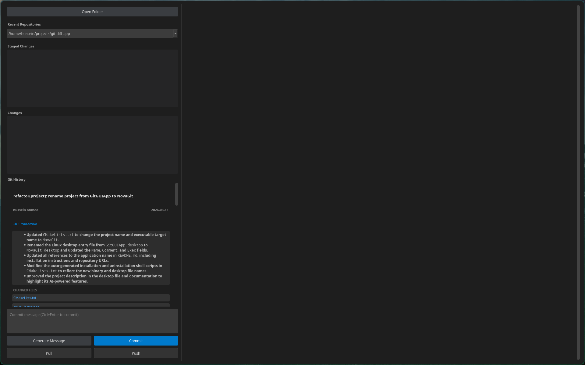

# NovaGit

An ultra-lightweight, modern Git GUI client built with C++ and Qt6, featuring AI-powered commit message generation.

## Why NovaGit?

In an era of bloated Electron-based applications, **NovaGit** stands out by being exceptionally efficient:

- **Ultra-Tiny Memory Footprint:** While GitHub Desktop often spawns multiple processes that can collectively consume **500MB to 1GB+** of RAM, and IDEs like Visual Studio frequently exceed **2GB**, NovaGit is built on native C++ and Qt, typically using only around **50MB**.
- **Blazing Fast:** Instant startup and responsive UI, even on large repositories.
- **Native Performance:** No web-tech or Electron overhead—just pure, compiled performance.

## Features

- **Visual Git Status:** View staged and unstaged changes at a glance.
- **Diff Viewer:** High-contrast, syntax-highlighted diffs for tracked files.
- **Commit History:** Browse through the repository's commit log with detailed views of each revision.
- **AI-Powered Commit Messages:** Automatically generate professional, Conventional Commits-compliant messages using the Gemini API.
- **File Management:** Stage/unstage individual files or all changes at once.
- **Core Git Operations:** Support for commit, push, pull, checkout, and reset (mixed/hard).
- **Tabbed Interface:** Open multiple diffs in tabs for easy comparison.
- **Recent Folders:** Quickly switch between frequently used repositories.

## Screenshots



## Prerequisites

- **C++17** compatible compiler (GCC, Clang, or MSVC)
- **Qt 6.0** or higher
- **CMake 3.16** or higher
- **Git** installed and available in your PATH

## Building the Project

1. **Clone the repository:**
   ```bash
   git clone https://github.com/yourusername/novagit.git
   cd novagit
   ```

2. **Create a build directory and run CMake:**
   ```bash
   mkdir build && cd build
   cmake ..
   ```

3. **Compile the application:**
   ```bash
   make -j$(nproc)
   ```

## Running the Application

After a successful build, you can run the application directly:
```bash
./build/NovaGit
```

### Installation (Optional)
The build process generates helper scripts to install or uninstall the application on Linux:
```bash
# Install to /usr/local/bin and add a desktop entry
sudo ./build/install.sh

# Uninstall
sudo ./build/uninstall.sh
```

## AI Commit Message Generation

To use the AI commit message feature, you need a Google Gemini API key:
1. Obtain an API key from [Google AI Studio](https://aistudio.google.com/).
2. Create a file named `.gemini_git_key` in your home directory:
   ```bash
   echo "YOUR_API_KEY" > ~/.gemini_git_key
   ```
3. In the application, click **"Generate AI Message"** when you have staged changes.

## Project Structure

- `src/`: Core source files (C++ & Headers).
- `CMakeLists.txt`: Project build configuration.
- `AGENTS.md`: Guidelines for autonomous agents working on this codebase.
- `NovaGit.desktop`: Linux desktop entry file.


## License

[MIT License](LICENSE) (Replace with your actual license if different)
